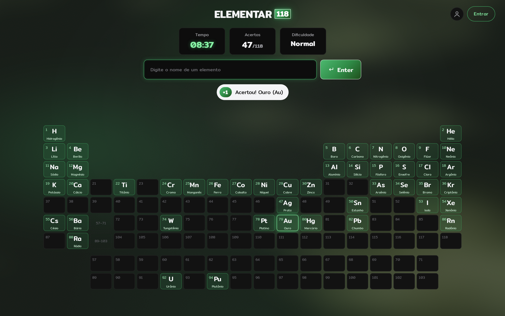
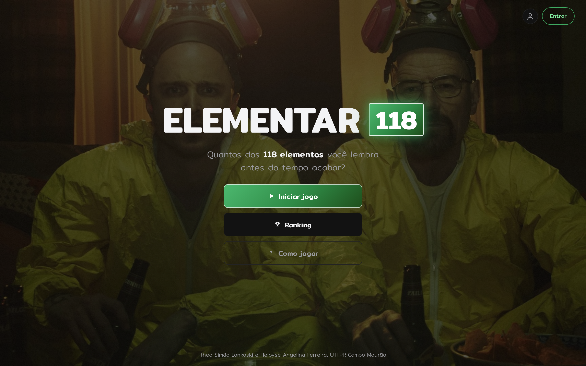
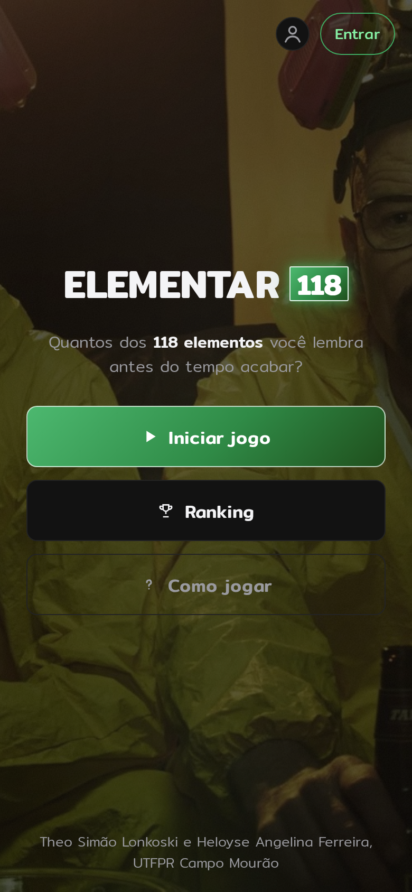
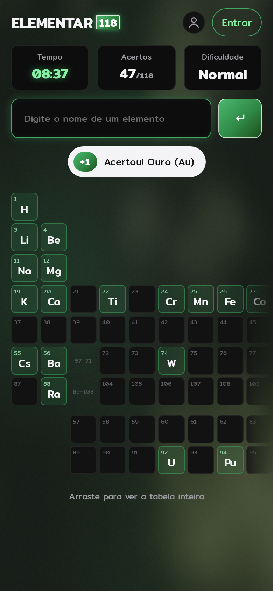
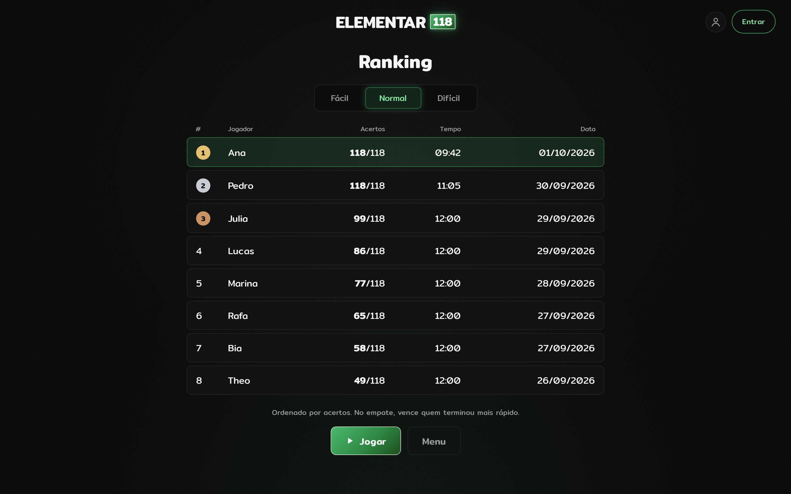
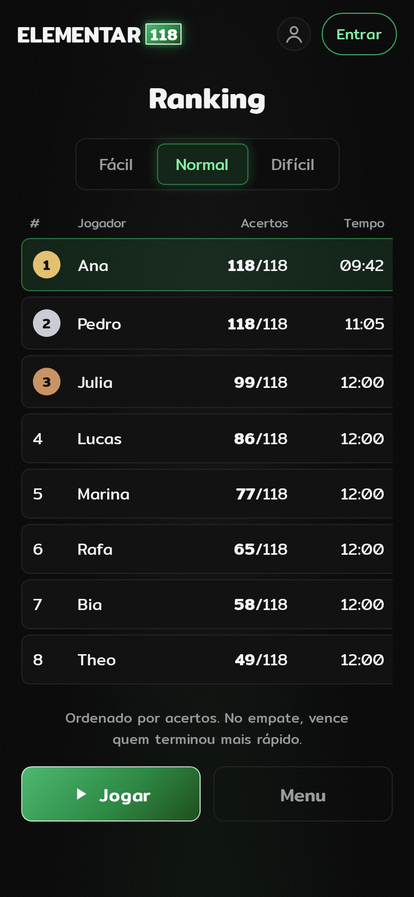

# ELEMENTAR 118

Jogo web para lembrar os **118 elementos da tabela periódica**. A tabela começa em branco e se
completa conforme o jogador acerta os nomes.

Projeto de Análise e Projeto de Sistemas (TI23L), UTFPR Campo Mourão, 2º semestre de 2026.

**Equipe:** Theo Simão Lonkoski e Heloyse Angelina Ferreira



## Regras

- O jogador digita o nome de um elemento e aperta Enter. Acentos, maiúsculas e espaços são
  ignorados, e sinônimos são aceitos (Azoto, Volfrâmio…).
- **Acertou:** a casa acende com o símbolo e o nome, e aparece "+1 Acertou!".
- **Já digitado:** a casa pisca e aparece "já está na tabela".
- **Não existe:** o campo treme e aparece "Esse elemento não existe".
- **Placar:** não há vidas nem pontos. O placar é o número de acertos (x/118). A cada 10 acertos
  aparece "Subiu de nível!".
- **Dificuldade:** muda só o tempo. Fácil 15:00, Normal 12:00, Difícil 10:00.
- **Vitória:** completar os 118. **Derrota:** o tempo zera ou o jogador desiste; os que faltaram
  aparecem destacados.
- **Ranking:** top 10 por dificuldade, salvo no `localStorage`. Ordem por acertos; no empate,
  quem terminou em menos tempo.

## Atendimento à especificação

| Exigência | Onde |
|---|---|
| Tela inicial com nome, instruções, Iniciar e Ranking | Tela Menu · UC01, UC02, UC10 |
| Mecânica principal e pontuação (acertos + tempo) | Tela Gameplay · UC04, UC05, UC06 |
| Estados: andamento, pausa, vitória e derrota | UC04, UC07, UC09 |
| Persistência e ranking | Tela Ranking · UC10, UC13 |
| Feedback (acertou, errou, subiu de nível, fim de jogo) | Tela Gameplay · UC05, UC06, UC09 |
| Jogar novamente e voltar ao menu | UC14 |
| Responsividade | 3 telas em desktop (1440×900) e celular (390×844) |
| **Extras:** níveis de dificuldade e conquistas | UC03, UC11, UC12 |
| Diagrama de casos de uso com `<<include>>` e `<<extend>>` | [docs/casos-de-uso.md](docs/casos-de-uso.md) |
| Histórias de usuário | [docs/historias-de-usuario.md](docs/historias-de-usuario.md) · [.txt](docs/historias-de-usuario.txt) |
| Kanban no Trello | *link do quadro em breve* |

## Protótipos de tela

Os protótipos oficiais são as 3 telas abaixo, em desktop e celular
([`prototipos/neon`](prototipos/neon)). O protótipo navegável está em
[`prototipo-neon/index.html`](prototipo-neon/index.html).

| Tela | Desktop | Celular |
|---|---|---|
| Menu |  |  |
| Gameplay |  |  |
| Ranking |  |  |

Visual: fundo preto com textura, verde dos quadrados de elemento e neon ao passar o mouse.
Fonte **Mitr** (Google Fonts).

As versões anteriores ficam como material de apoio em `prototipos/final`, `prototipos/desktop`
e `prototipos/mobile`.

## Estrutura

```
elementar-118/
├── README.md
├── docs/
│   ├── casos-de-uso.png/.svg   diagrama de casos de uso
│   ├── casos-de-uso.puml       fonte PlantUML
│   ├── casos-de-uso.md         include/extend justificados e descrição dos casos
│   ├── historias-de-usuario.md / .txt
│   └── gerar-diagrama.py
├── prototipo-neon/             protótipo visual navegável (oficial)
├── prototipo/                  protótipo HTML anterior + elementos.js
└── prototipos/                 imagens (neon = oficial)
```

`prototipo/elementos.js` traz os 118 elementos e a função `normalizar()`, que serão reaproveitados
no código do jogo no 4º bimestre.
