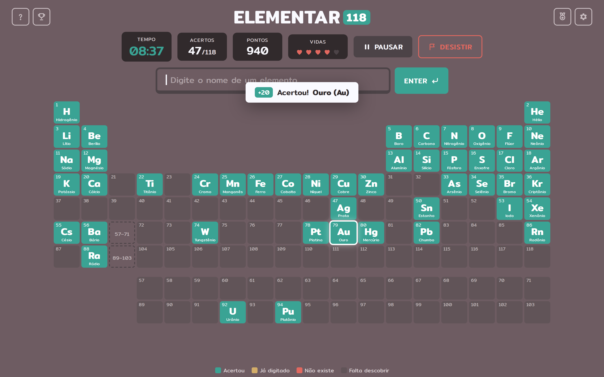
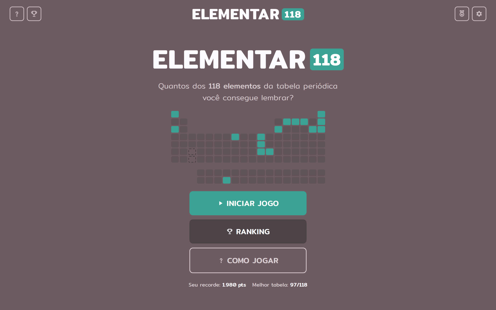
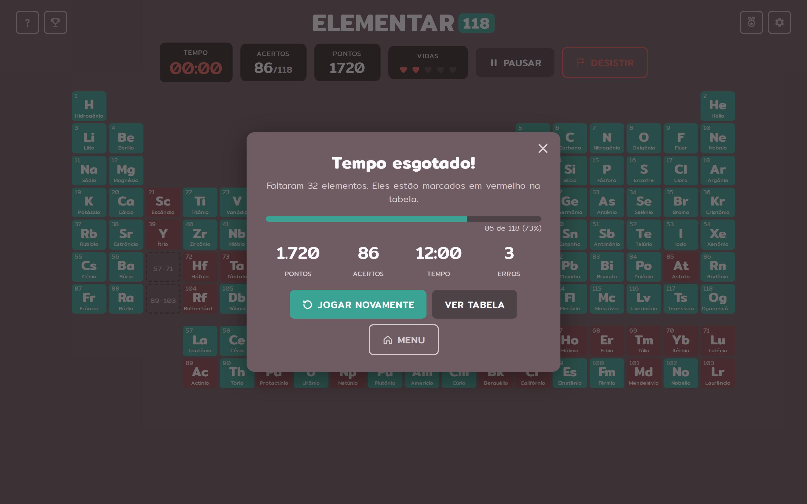
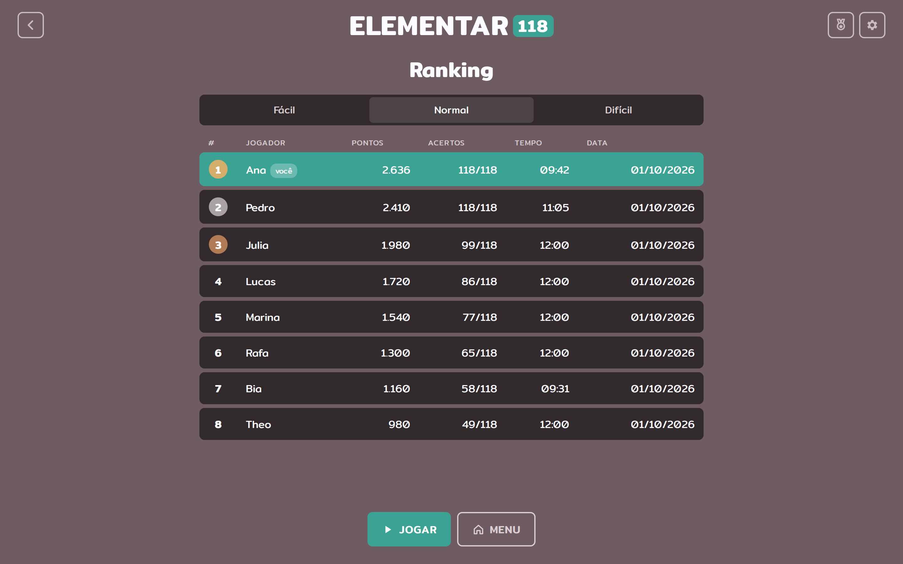
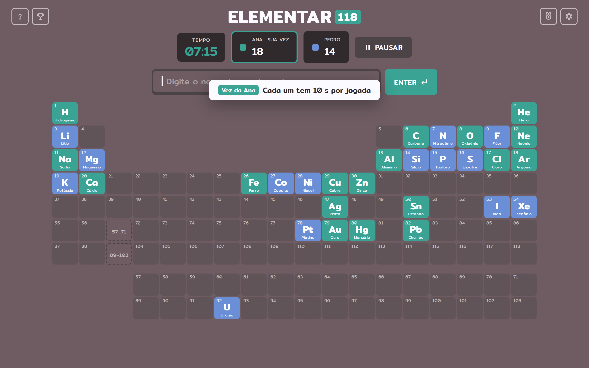
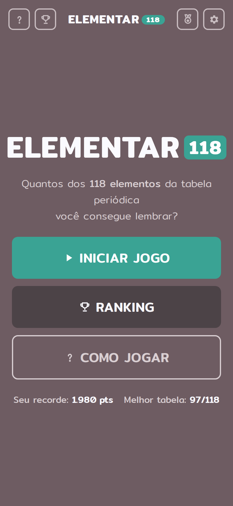
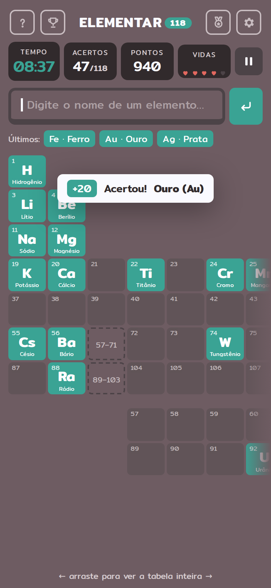
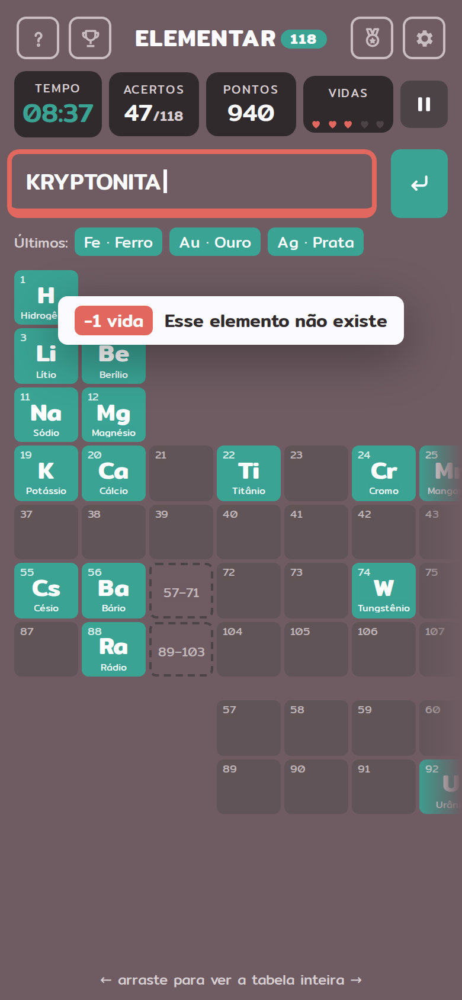
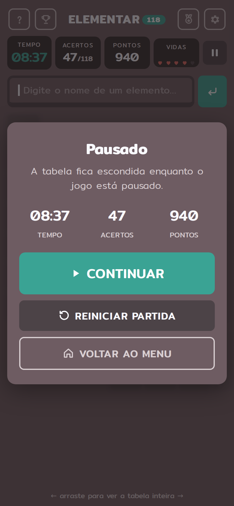
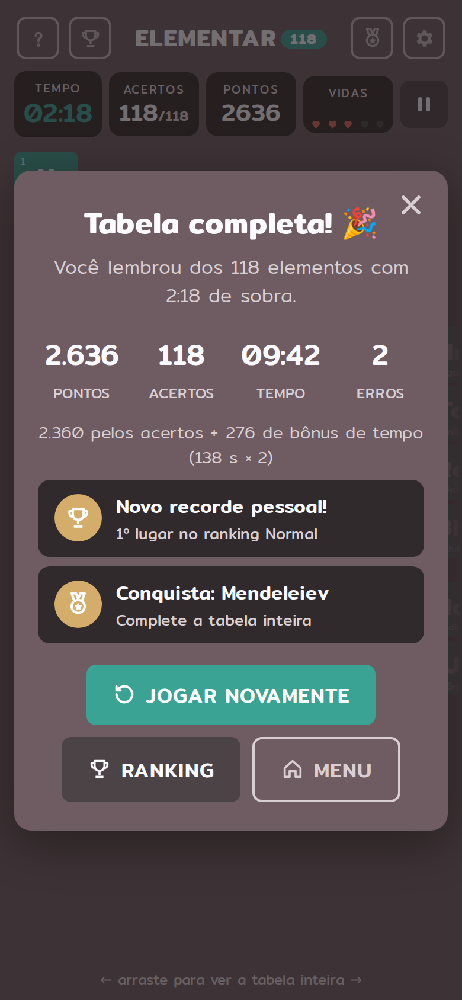

# ELEMENTAR 118

Jogo web para lembrar os **118 elementos da tabela periódica**. A tabela começa em branco e se
completa conforme o jogador acerta os nomes.

Projeto de Análise e Projeto de Sistemas (TI23L), UTFPR Campo Mourão, 2º semestre de 2026.



## Referências

- **Mecânica: JetPunk, *Elements of the Periodic Table*.** Quiz de digitar o nome dos elementos
  contra o relógio. A tabela mostra só os números atômicos, cada acerto preenche a casa, o
  contador mostra *x / 118* e o botão *Give up* revela os que faltaram.
- **Visual: Termo (term.ooo).** A versão brasileira do Wordle, com fundo roxo-acinzentado, casas
  arredondadas, verde para acerto, amarelo para "quase", fonte Mitr, ícones nos cantos do
  cabeçalho e mensagens em "toast" no topo.

O que o ELEMENTAR 118 acrescenta ao JetPunk: vidas, pontuação com combos, dificuldades, pausa,
ranking local, conquistas, modo em dupla e tema claro/escuro, como pede a especificação.

## Regras

| | Fácil | Normal | Difícil |
|---|---|---|---|
| Tempo | 15:00 | 12:00 | 10:00 |
| Dica na tabela | símbolo aparece apagado | número atômico | nada |
| Vidas | ∞ | 5 | 3 |
| Pontos por acerto | 10 | 20 | 30 |

- **Resposta:** o jogador digita o nome e aperta Enter. Acentos, maiúsculas e espaços são
  ignorados, e sinônimos são aceitos (Azoto, Volfrâmio, Arsênico…).
- **Acertou (verde):** a casa se preenche com o símbolo e o nome.
- **Já digitado (amarelo):** a casa pisca. Não perde nada.
- **Não existe (vermelho):** o campo treme e o jogador perde 1 vida.
- **Combo:** a cada 5 acertos seguidos, +40 pontos. Um erro zera a sequência.
- **Vitória:** completar os 118 elementos. Bônus de segundos restantes × 2.
- **Derrota:** o tempo zera, as vidas acabam ou o jogador desiste. Os que faltaram aparecem em
  vermelho.
- **Ranking:** top 10 por dificuldade, salvo no `localStorage`.

## Atendimento à especificação

| Exigência | Onde |
|---|---|
| Tela inicial com apresentação, instruções, Iniciar e Ranking | telas 01, 02 |
| Mecânica principal e pontuação (pontos, vidas, tempo) | telas 04–09 |
| Estados em andamento, pausa, vitória e derrota | telas 04, 10, 12, 13/14 |
| Persistência e ranking | tela 15 (`localStorage`) |
| Feedback (acertou, errou, combo, fim de jogo) | telas 04–07, 09 |
| Jogar novamente e voltar ao menu | telas 10, 12, 13 |
| Responsividade | todas as telas em desktop (1440×900) e celular (390×844) |
| **Extras:** dificuldades, som com mudo, conquistas, multiplayer local, tema | telas 03, 16, 17, 18, 19 |
| Diagrama de casos de uso com `<<include>>` e `<<extend>>` | [docs/casos-de-uso.md](docs/casos-de-uso.md) |
| Histórias de usuário | [docs/historias-de-usuario.md](docs/historias-de-usuario.md) |
| Kanban no Trello | [docs/kanban-trello.md](docs/kanban-trello.md) |

## Protótipos de tela

As imagens estão em [`prototipos/desktop`](prototipos/desktop) e [`prototipos/mobile`](prototipos/mobile).
A galeria completa está em [`prototipos/index.html`](prototipos/index.html).

| # | Tela | # | Tela |
|---|---|---|---|
| 01 | Menu inicial | 11 | Confirmar desistência |
| 02 | Como jogar | 12 | Vitória |
| 03 | Nova partida (nome, modo, dificuldade) | 13 | Derrota: tempo esgotado |
| 04 | Jogo: acertou | 14 | Derrota: sem vidas |
| 05 | Jogo: não existe | 15 | Ranking |
| 06 | Jogo: já digitado | 16 | Conquistas |
| 07 | Jogo: combo | 17 | Configurações |
| 08 | Jogo no Fácil (dica de símbolo) | 18 | Multiplayer local |
| 09 | Jogo: último minuto | 19 | Tema claro |
| 10 | Pausa | | |

<table><tr>
<td></td>
<td></td>
</tr><tr>
<td></td>
<td></td>
</tr></table>

<p>





</p>

### Levando para o Figma

As **telas principais** (menu, gameplay e ranking, em desktop e celular) estão em
[`prototipos/figma/`](prototipos/figma) como SVG. Para usar:

1. Crie um arquivo no Figma com a fonte **Mitr** disponível (ela já vem nas Google Fonts do Figma).
2. Arraste os 6 arquivos `.svg` para o canvas. Cada um vira um frame com retângulos, textos e
   ícones **editáveis**.
3. Opcional: renomeie os frames para `Desktop / Menu`, `Mobile / Gameplay` etc.

Para gerar os SVGs de novo depois de mudar o protótipo: `cd prototipo && node exportar-svg.mjs`.

As outras telas (modais de instruções, pausa, vitória, derrota, conquistas etc.) estão como PNG
em `prototipos/desktop` e `prototipos/mobile`. Também dá para importá-las editáveis com o plugin
**html.to.design**, abrindo `prototipo/prototipo.html?tela=<nome>&disp=desktop` (ou `disp=mobile`).
Os nomes das telas (`menu`, `como-jogar`, `nova-partida`, `jogo`, `jogo-erro`, `jogo-repetido`,
`jogo-combo`, `jogo-facil`, `jogo-ultimo-minuto`, `pausa`, `confirmar-desistir`, `vitoria`,
`derrota`, `sem-vidas`, `ranking`, `conquistas`, `config` e `multiplayer`) estão em
`prototipo/telas.js`. Acrescente `&tema=claro` para o tema claro.

Para gerar os PNGs de novo: `cd prototipo && node gerar-imagens.mjs` (precisa do `playwright`).

### Paleta

| Uso | Cor |
|---|---|
| Fundo | `#6e5c62` |
| Casa vazia | `#615458` |
| Painéis | `#312a2c` |
| Acerto | `#3aa394` |
| Já digitado / conquista | `#d3ad69` |
| Erro | `#e2685f` |
| Faltou | `#8b4a4f` |
| Jogador 2 | `#6a8fd6` |

Fonte: **Mitr** (Google Fonts), incluída em `prototipo/fontes`.

## Estrutura

```
elementar/
├── README.md                  este documento
├── docs/
│   ├── casos-de-uso.png/.svg  diagrama de casos de uso
│   ├── casos-de-uso.puml      fonte PlantUML do diagrama
│   ├── casos-de-uso.md        include/extend justificados e descrição dos casos
│   ├── historias-de-usuario.md
│   ├── kanban-trello.md       cronograma até a entrega de dezembro
│   └── gerar-diagrama.py
├── prototipo/                 protótipo HTML/CSS das telas
│   ├── elementos.js           os 118 elementos (nome PT-BR, símbolo, posição, sinônimos)
│   ├── telas.js / prototipo.css / prototipo.html
│   ├── gerar-imagens.mjs      gera os PNGs
│   └── exportar-svg.mjs       gera os SVGs editáveis para o Figma
└── prototipos/                imagens exportadas (desktop, mobile e figma/)
```

`prototipo/elementos.js` já traz os dados e a função `normalizar()`, que podem ser reaproveitados
no código do jogo no 4º bimestre.
