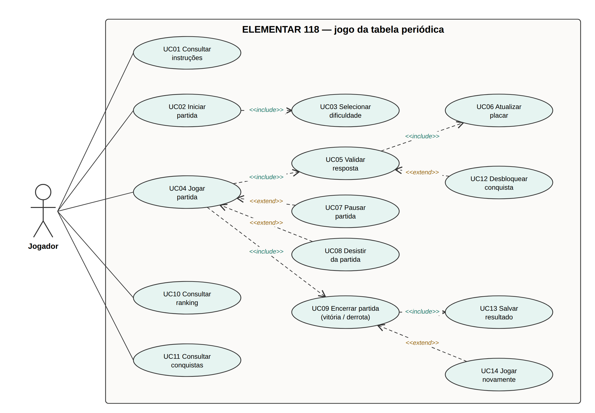

# Casos de uso

Fonte editável: [`casos-de-uso.puml`](casos-de-uso.puml) (PlantUML). A imagem também é gerada por
[`gerar-diagrama.py`](gerar-diagrama.py).

Ator único: **Jogador**.

## Por que cada `<<include>>` e `<<extend>>`

**`<<include>>`**: o caso base *sempre* executa o incluído.

| Base | Incluído | Motivo |
|---|---|---|
| UC02 Iniciar partida | UC03 Selecionar dificuldade | Toda partida precisa de uma dificuldade, que define o tempo. O Normal vem pré-selecionado. |
| UC04 Jogar partida | UC05 Validar resposta | Cada nome enviado passa pela validação. |
| UC05 Validar resposta | UC06 Atualizar placar | Toda validação atualiza o contador de acertos e a tabela. |
| UC04 Jogar partida | UC09 Encerrar partida | Toda partida termina em vitória ou derrota. |
| UC09 Encerrar partida | UC13 Salvar resultado | Todo resultado vai para o ranking no `localStorage`. |

**`<<extend>>`**: o caso de extensão acontece *só às vezes*, sob uma condição.

| Extensão | Base | Condição |
|---|---|---|
| UC07 Pausar partida | UC04 Jogar partida | O jogador aperta Pausar ou `Esc`. |
| UC08 Desistir da partida | UC04 Jogar partida | O jogador aperta Desistir e confirma. |
| UC12 Desbloquear conquista | UC05 Validar resposta | O acerto completa a condição de alguma conquista. |
| UC14 Jogar novamente | UC09 Encerrar partida | O jogador escolhe "Jogar novamente" no fim da partida. |

## Descrição resumida

| ID | Caso de uso | Resumo |
|---|---|---|
| UC01 | Consultar instruções | Mostra como jogar. |
| UC02 | Iniciar partida | Informa o nome, escolhe a dificuldade e começa com a tabela em branco. |
| UC03 | Selecionar dificuldade | Fácil (15:00), Normal (12:00) ou Difícil (10:00). |
| UC04 | Jogar partida | Digita nomes de elementos até completar a tabela ou o tempo acabar. |
| UC05 | Validar resposta | Ignora acento, maiúscula e espaço; aceita sinônimos. Resultado: acerto, repetido ou inexistente. |
| UC06 | Atualizar placar | Soma o acerto ao contador x/118; a cada 10 acertos, "Subiu de nível!". |
| UC07 | Pausar partida | Para o cronômetro e esconde a tabela. |
| UC08 | Desistir da partida | Pede confirmação e encerra como derrota. |
| UC09 | Encerrar partida | Vitória (118/118) ou derrota (tempo esgotado ou desistência); revela os que faltaram. |
| UC10 | Consultar ranking | Top 10 por dificuldade: mais acertos e, no empate, menor tempo. |
| UC11 | Consultar conquistas | Lista as bloqueadas e as desbloqueadas. |
| UC12 | Desbloquear conquista | Mostra a conquista e salva no `localStorage`. |
| UC13 | Salvar resultado | Grava nome, acertos, tempo usado, dificuldade e data. |
| UC14 | Jogar novamente | Reinicia com as mesmas configurações, sem recarregar a página. |
